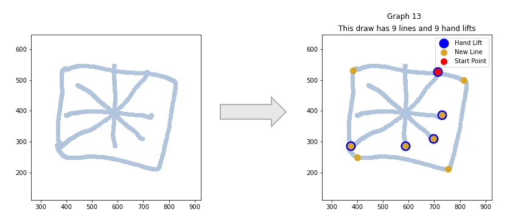

# Drawing Analysis Tool

## Overview
The Drawing Analysis Tool is a sophisticated data analysis project designed to analyze drawings created by children. This tool is specifically developed for professionals in the field who wish to gain valuable insights from the drawing data and make informed assessments.

The project includes a set of Jupyter Notebook scripts that perform various data processing and analysis tasks on the drawing dataset. These tasks involve data cleaning, feature engineering, visualization, and line counting algorithms. The project aims to provide professionals with a comprehensive understanding of the drawings, enabling them to extract meaningful information and draw relevant conclusions.

## Dataset
The drawing dataset consists of a collection of CSV files, each representing an individual drawing by a child. The CSV files contain the following columns:

- X: X-coordinate of each point in the drawing (float).
- Y: Y-coordinate of each point in the drawing (float).
- Pressure: Pressure values recorded during drawing (float).
- TiltX: Tilt along the X-axis during drawing (float).
- TiltY: Tilt along the Y-axis during drawing (float).
- Time: Timestamps indicating the time at which each point was recorded (datetime).

The dataset captures the spatial and temporal aspects of the drawings, allowing professionals to analyze the stroke patterns, pressure variations, and other relevant factors.

## Usage
1. Place the drawing files (in CSV format) inside the data directory.
2. Update the file paths in the Jupyter Notebook to match your specific dataset location.
3. Open the Jupyter Notebook: `jupyter notebook`.
4. Run the cells in the Notebook sequentially to perform data cleaning, visualization, and analysis.
5. Review the generated visualizations and extracted insights to gain a deeper understanding of the drawings.

## Results and Insights
The Drawing Analysis Tool provides several key outputs and insights:

- Line Count: The tool accurately counts the number of lines in each drawing, allowing professionals to assess the complexity and structure of the artwork.
- Hand Lift Detection: By analyzing temporal differences between data points, the tool identifies instances of hand lifts during the drawing process.
- Graphical Visualization: The tool generates detailed graphs that showcase the drawings, hand lifts, lines, and start points. These visualizations facilitate a comprehensive examination of the artwork.
- Statistical Analysis: Professionals can extract valuable statistical information, such as average pressure, stroke length, and slope between points, to gain deeper insights into the drawing patterns.

## Future Enhancements
The Drawing Analysis Tool serves as a foundation for further advancements in the field of child drawing analysis. Future enhancements could include:

- Integration of machine learning algorithms for advanced pattern recognition and classification.
- Development of additional visualization techniques to explore and interpret the drawings from different perspectives.
- Collaboration features to enable professionals to share and compare analyses, fostering knowledge sharing and collective learning.

## Conclusion
The Drawing Analysis Tool empowers professionals in the field of child psychology and development to analyze and interpret children's drawings effectively. By leveraging advanced data processing techniques and visualization tools, this project facilitates a deeper understanding of the drawings and provides valuable insights into a child's creative expression.